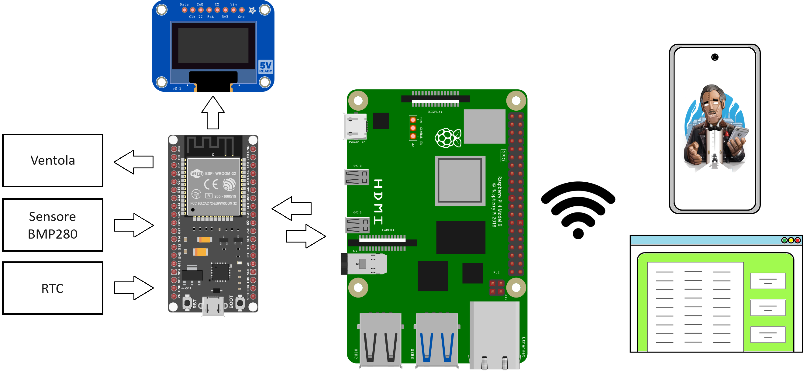
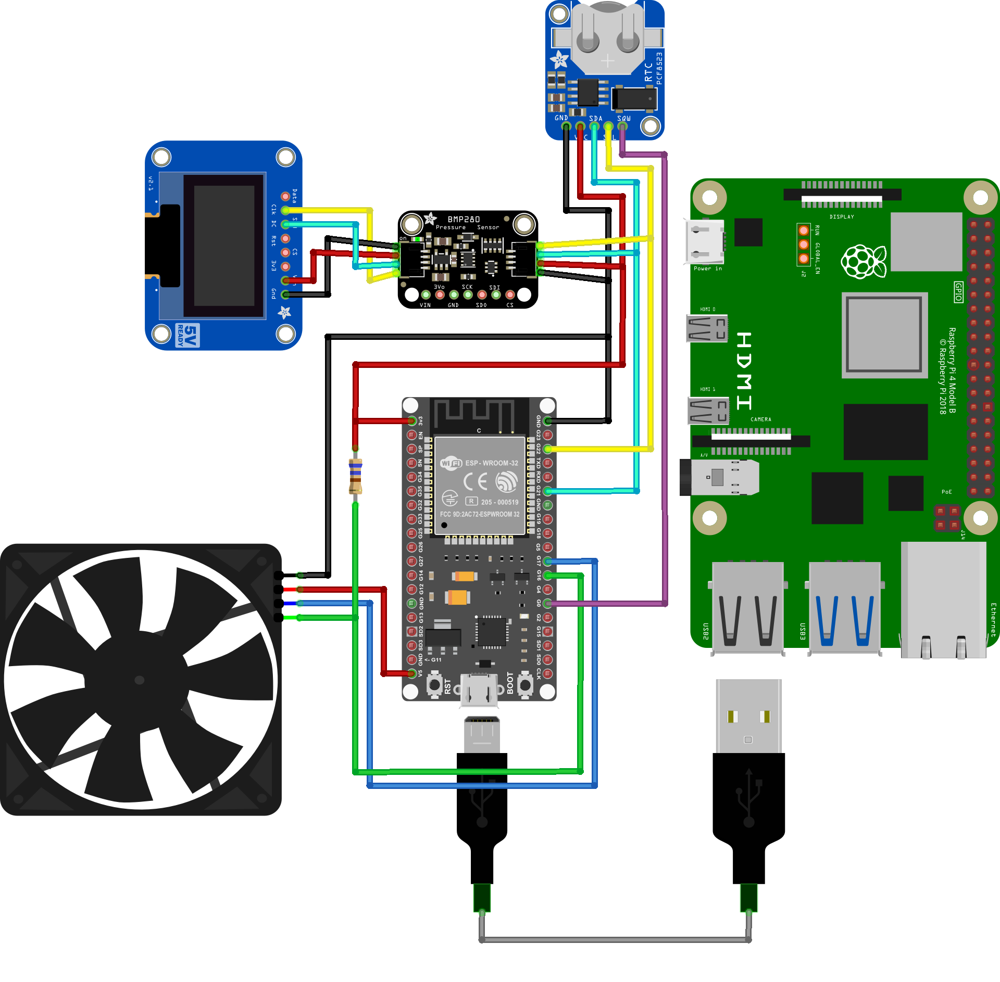

# Sistema di acquisizione dati per il monitoraggio ambientale

Progetto didattico del corso di Sistemi Operativi Dedicati di laurea magistrale 2022-2023 presso l'università Politecnica delle Marche. 

<details>
  <summary>Indice</summary>
  
  - [Descrizione del Progetto](#descrizione-del-progetto)
    - [Strumenti Utilizzati](#strumenti-utilizzati)
    - [Funzionamento](#funzionamento)
  - [Struttura Repository](#struttura-repository)
  - [Installazione delle componenti software](#installazione-delle-componenti-software)
  - [Demoni](#demoni)
  - [Autori](#autori)
</details>

## Descrizione del Progetto
Il progetto ha l'obiettivo di realizzare un sistema completo per il monitoraggio, la visualizzazione e il controllo dei parametri ambientali. Combinando hardware e software, il sistema è progettato per acquisire, elaborare e visualizzare i dati raccolti da vari sensori.

### Strumenti Utilizzati
Il sistema è composto da diversi componenti hardware e software, progettati per lavorare insieme al fine di monitorare e controllare i parametri ambientali. Di seguito è riportato un riassunto dei principali strumenti utilizzati.

#### Componenti hardware
- **ESP32**: Responsabile dell'acquisizione dei dati dal sensore BMP280, del controllo della ventola tramite segnale PWM, della sincronizzazione del modulo RTC tramite un comando inviato periodicamente dalla Raspberry Pi, e della visualizzazione delle informazioni sul display OLED.
- **Raspberry Pi 4**: Agisce come server IoT, ricevendo i dati dalla ESP32 tramite comunicazione seriale, memorizzando i dati in un database e rendendoli disponibili agli utenti tramite un'interfaccia web semplice e intuitiva.
- **Sensore BMP280**: Utilizzato per monitorare la temperatura e la pressione.
- **Ventola**: Attivata e controllata dall'ESP32 per raffreddare il sistema quando la temperatura supera una soglia predefinita.
- **Display OLED**: Mostra in tempo reale le informazioni sulla temperatura, la pressione e la velocità della ventola.
- **Modulo RTC**: Sincronizza l'orario con la Raspberry Pi.

#### Componenti software

-   **(v. 1.8.19)**
-   **(v. 1.1.9)**
-    **(v. 3.0.1)**
- 
-    **(v. 2.4.57-2)**


#### Linguaggi di Programmazione
-  e  
-   **(v. 3.11.2)**
- 
-  

  
#### Funzionamento:
- La scheda ESP32 acquisisce i dati dal sensore BMP280, controlla la ventola e visualizza le informazioni sul display OLED.
- I dati acquisiti vengono inviati alla Raspberry Pi, che li memorizza in un database e li rende disponibili tramite un'interfaccia web.
- Il sistema consente di visualizzare tendenze e di eseguire semplici analisi dei dati raccolti.
- Un bot Telegram permette agli utenti di richiedere dati specifici e di ricevere visualizzazioni grafiche e valori statistici.
- Notifiche di allarme vengono inviate tramite il bot Telegram agli utenti registrati se la temperatura supera una soglia critica.



Ad ogni modo, il primo passaggio consiste nel collegare i vari dispositivi sulla breadboard, come mostrato nella figura che segue. 

<!---->
<p align="center">
  
</p>

## Struttura Repository 
```bash
├─ RPI
    ├─ Flask
         ├─ static          
              └─ style.css            
         ├─ templates
              └─ index.html              
         └─ app.py             
    ├─ bash_files           
         ├─ service_bot.sh 
         ├─ service_db.sh            
         ├─ service_sync.sh            
         └─ service_webapp.sh        
    ├─ service_timer_files
         ├─ bot_service.service           
         ├─ db_service.service
         ├─ sync_service.service            
         ├─ sync_service.timer             
         └─ webapp_service.service            
    ├─ sync_timer.py              
    ├─ database.py             
    ├─ chatbot.py               
    └─ requirements.txt       
├─ datasheet           
    ├─ ESP32
         ├─ ESP-32 Dev Kit C V2_ITA.pdf             
         ├─ ESP32 datasheet.txt              
         └─ esp32-wroom-32d_esp32-wroom-32u_datasheet_en.pdf                
    ├─ bmp280            
         └─ BMP280.pdf               
    ├─ rtc           
         ├─ AN11247_pcf8523.pdf               
         └─ adafruit-pcf8523-real-time-clock.pdf            
    └─ link_datasheet_utili.txt       
├─ esp32freeRTOS             
    └─ esp32freeRTOS.ino     
├─ images              
    ├─ cablaggio_660Ohm.png             
    ├─ logounivpm.png               
    └─ schema_blocchi.png   
├─ README.md                    
└─ Traccia_Progetto.pdf
```

## Installazione delle componenti software 
Il progetto è articolato in due principali sezioni: la prima riguarda l'ESP32, mentre la seconda si concentra sulla Raspberry Pi 4. Di seguito sono riportate le sezioni relative a ciascuna di queste macro-aree. 

### ESP32
#### Arduino IDE
Installare l'[IDE di Arduino](https://www.arduino.cc/en/software) `v1.8.19` a seconda del sistema operativo utilizzato e   seguire le istruzioni nella finestra di installazione. 
Una volta installato, aprire l'Arduino IDE e configurarlo al file di utilizzarlo con una board di tipo ESP32:

- **Installare il driver per la comunicazione USB-seriale**

   Se questo non viene installato automaticamente al collegamento del microcontrollore, è necessario scaricarlo dal sito di [Silicon Labs](https://www.silabs.com/interface/usb-bridges/classic/device.cp2102).

- **Abilitare il supporto per la piattaforma EPS3**

   Andare su `File > Preferenze`, nella sezione
`"URL aggiuntivi per il Gestore delle Schede"`, e incollare il seguente URL:
https://dl.espressif.com/dl/package_esp32_index.json
NB. Se ci sono già altri URL, aggiungere una virgola alla fine e poi incollare il nuovo URL.

- **Installazione del tipo di scheda ESP32**
  
    Andare su `Strumenti > Scheda > Gestore delle Schede`. Nella casella di ricerca digitare `esp32` e installare la versione `2.0.11` della scheda prodotta da *Espressif Systems*.

- **Selezione della scheda ESP32**

    Andare su `Strumenti > Scheda` e selezionare `ESP32 Dev Module`.

- **Selezione della porta**

    Collegare la scheda ESP32 al pc tramite un cavo USB. Andare su `Strumenti > Porta` e selezionare la porta corrispondente alla scheda (es. `COM3` su *Windows* o `/dev/ttyUSB0` su *Linux*).

- **Caricamento del codice**

    Scrivere o aprire uno sketch per ESP32 e cliccare su `Carica`. Se non funziona al primo tentativo, premere il pulsante `Boot` sul dispositivo ESP32 durante il caricamento.

Per utilizzare correttamente il progetto con l'ESP32, è necessario installare librerie specifiche nell'ambiente di sviluppo Arduino IDE con le rispettive versioni:

 - **RTClib.h**                       `v2.1.3`
 - **Adafruit_BMP280.h**       `v2.6.8`
 - **Adafruit_GFX.h**          `v1.11.9` 
 - **Adafruit_SSD1306.h**  `v2.5.9`


### RaspBerry Pi 4
#### Installazione di L.A.M.P e librerie necessarie 

##### LINUX
Per installare il sistema operativo sulla Raspberry Pi scaricare [Raspberry Pi Imager](https://www.raspberrypi.com/software/). Terminata l'installazione, dalla schermata iniziale del tool selezionare il modello specifico di Raspberry Pi, il sistema operativo e la scheda SD per la memorizzazione dello stesso sistema operativo. Al termine di ciò, viene aperta una nuova finestra di dialogo per la configurazione personalizzata delle seguenti impostazioni: 

- **Nome Host** per identificare facilmente il dispositivo nella rete
- **SSH** per consentire connessioni sicure e crittografate al dispositivo
- **Wi-Fi** per garantire l'accesso a Internet inserire l'SSID e la password della rete wireless

Al termine del processo inserire la microSD nella Raspberry Pi e connettersi a quest'ultima utilizzando il comando: 

```bash
ssh [username]@[IP_address]
```

Prima di procedere con l'installazione dei successivi pacchetti necessari è buona pratica aggiornare l'elenco dei pacchetti, risolvere le dipendenze e migliorare la sicurezza del sistema, tramite il comando:

```bash
 sudo apt update && sudo apt upgrade
```

##### APACHE2

Installare Apache2:
```bash
    sudo apt install apache2==2.4.57-2
```
Per la verifica dello stato e il riavvio del servizio: 
```bash
    sudo systemctl status apache2
    sudo systemctl restart apache2
```
##### MARIADB

Installare MariaDB:
```bash
sudo apt install mariadb-server==1.10.11.4-1
```
Riavviare il servizio MariaDB al fine di verificare che tutto è installato correttamente:
```bash
    sudo systemctl restart mariadb.service
```

Per proteggere l'installazione è consigliabile: 
```bash
    sudo mysql_secure_installation
```
Viene visualizzata una finestra di dialogo: inserire la password corrente per l'utente root e impostare una nuova password. Al termine del processo di configurazione, verrà visualizzato il messaggio *Grazie per aver utilizzato MariaDB*.

Effettuare l'accesso a MariaDB: 
```bash
sudo mysql --user=root --password  
```

##### MARIADB - Creazione del database 
Creare il database e definire la tabella con i campi opportuni:
```bash
MariaDB [mysql]> create database SensorData;
MariaDB [mysql]> use SensorData;
MariaDB [SensorData]> CREATE TABLE misure(
-> id INT NOT NULL AUTO_INCREMENT,
-> Data DATETIME,
-> Temperatura FLOAT,
-> Pressione FLOAT,
-> RPM INT,
-> PRIMARY KEY (id)
-> );
```

##### PHP
Installare PHP:
```bash
    sudo apt install php==2:8.2+93
    sudo apt install phpmyadmin==4:5.2.1+dfsg-1
```

Durante l'installazione di PHPMyadmin verrà visualizzata una finestra di dialogo in cui verrà chiesto di confermare l'utilizzo di *apache2* e *dbconfig-common* per la configurazione del database. Successivamente, verrà richiesta la configurazione di una password per l'accesso a MySQL tramite PHPMyAdmin.

> Qualora si riscontrassero errori durante l'accesso a PHPMyAdmin, potrebbe essere necessario creare un nuovo utente. Questi comandi creeranno un nuovo utente con nome *admin* e password *password*. Le credenziali NON devono necessariamente coincidere con quanto riportato, ma possono essere liberamente selezionate dall'utente. Qui vengono fornite delle credenziali esemplificative, offrendo all'utente la flessibilità di scegliere le proprie informazioni di accesso.
>```bash
>        sudo mysql 
>        > create user admin@localhost identified by 'your_password';
>        > grant all privileges on *.* to admin@localhost;
>        > FLUSH PRIVILEGES;
>       > exit;
>```

##### Creazione ambiente virtuale 

Per prima cosa installare Python3 e pip:
```bash
sudo apt install python3
sudo apt install python3-pip
```

Per creare ed effettuare l'accesso ad un ambiente virtuale eseguire le istruzioni direttamente nel terminale della RaspBerry: 

- Creazione ambiente virtuale. Questo comando deve essere eseguito solo la prima volta; nel nostro caso è stato creato un ambiente virtuale chiamato *progett_sod* al cui interno viene installata l'ultima versione del linguaggio Python (v. 3.11.2) e del gestore dei pacchetti pip (v. 23.0.1)
- 
```bash
        python3 -m venv progett_sod python=3.11.2
```
        
- Attivazione ambiente virtuale. Questo comando va eseguito ogni volta che si vuole usufruire dei pacchetti installati all'interno di un determinato ambiente virtuale.
- 
```bash
        source progett_sod/bin/activate
```

Successivamente per installare tutte le dipendenze necessarie per il progetto, assicurati di avere `pip` installato. Poi, esegui il seguente comando nel terminale all'interno della directory principale del repository:

```bash
pip install -r RPI/requirements.txt
```


## Demoni 
Questa sezione descrive la configurazione dei daemon per eseguire gli script Python associati al progetto. All'interno della cartella `service_timer_files` sono contenuti i file `.timer` e `.service` da dover salvare all'interno del percorso `/lib/system/systemd/`; i file presenti all'interno della cartella `bash_files` includono i file `.sh` da dover salvare nella stessa directory in cui sono presenti i rispettivi file `.py`.

### Servizi Implementati

1. **sync_service.service**
    - **Descrizione:** Sincronizzazione RTC tramite protocollo NTP.
    - **File di Supporto:** `service_sync.sh`
    - **Script Eseguito:** `sync_timer.py`
    - **Timer:** `sync_service.timer`

2. **db_service.service**
    - **Descrizione:** Gestione del database.
    - **File di Supporto:** `service_db.sh`
    - **Script Eseguito:** `database.py`

3. **app_service.service**
    - **Descrizione:** Gestione della web app.
    - **File di Supporto:** `service_webapp.sh`
    - **Script Eseguito:** `app.py`

4. **bot_service.service**
    - **Descrizione:** Gestione del chatbot.
    - **File di Supporto:** `service_bot.sh`
    - **Script Eseguito:** `chatbot.py`

### Abilitazione e Avvio dei Servizi

#### Abilitazione del Timer

```bash
systemctl enable sync_service.timer
```

#### Verifica dello Stato

```bash
systemctl status sync_service.timer
systemctl status sync_service.service
```

#### Abilitazione dei Servizi Database, Web app e Chatbot

```bash
systemctl enable db_service.service
systemctl enable webapp_service.service
systemctl enable bot_service.service
```

#### Verifica dello Stato

```bash
systemctl status db_service.service
systemctl status webapp_service.service
systemctl status bot_service.service
```

#### Reboot del Sistema

```bash
sudo reboot
```

##### Note
- Assicurarsi che i file `.sh` e `.service` contengano la corretta posizione dei file all'interno del proprio sistema operativo;
- Assicurarsi che i file `bash` siano eseguibili con `chmod +x`;
- Dopo il reboot, tutti i servizi verranno avviati automaticamente secondo le dipendenze configurate.


## Autori

|Nome autore 
|-----
|`Ciuffreda Silvia`
|`Liberatore Luca`
|`Serafini Andrea`

